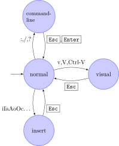

# **Vim 단축키**

## Insert 모드

### 단축키: i

- 텍스트를 입력하거나 수정할 때 사용됩니다

### Insert 모드에서 사용하는 단축키

1. 왼쪽 이동: h
1. 오른쪽 이동: l
1. 위쪽 이동: k
1. 아래쪽 이동: j

## Replace 모드

### 단축키: R

- Replace 모드에 들어가면, 문자를 대체할수 있다.

## Visual 모드

### 단축키: v

#### 텍스트를 선택하고 조작할 때 사용됩니다. Visual 모드를 사용하면 텍스트를 선택하고 해당 선택된 영역에 대한 작업을 수행할 수 있습니다.

#### Visual 모드에는 세 가지 하위 모드가 있습니다

1. Character Visual 모드
1. Line Visual 모드
1. 그리고 Block Visual 모드

## Visual 모드에서 사용하는 단축키

### 되돌리기

1. 되돌리기: u
1. 다시 실행: control + r

### 커서의 이동

1. 단어 단위로 오른쪽으로 이동: w
1. 단어 단위로 왼쪽으로 이동: b
1. 당어 단위로 오른쪽으로 이동하고 커서를 단어 끝으로 이동: e
1. 줄의 처음으로 이동: 0
1. 줄의 끝으로 이동: $
1. 파일의 처음으로 이동: gg
1. 파일의 끝으로 이동: G
1. 현재 보여지는 Window의 끝줄 이동: L
1. 현재 보여지는 Window의 처음줄로 이동: H
1. 현재 보여지는 Window의 중간줄로 이동: M

### 알파벳 찾기
#### 같은 줄에서
1. 오른(앞)쪽으로 가면서 알파벳 찾기: f + 찾으려는_문자
1. 왼(뒤)쪽으로 가면서 알파벳 찾기: F + 찾으려는_문자

### 줄 넣기

1. 커서 밑에 새로운 줄 넣기: o
1. 커서 위에 새로운 줄 넣기: O

### 삭제

1. 오른쪽으로 단어 단위로 빈공간을 포함해서 삭제: d + w
1. 오른쪽으로 단어 단위로 빈공간을 포함하지 않고 삭제: d + e

### 줄에 관하여

1. 붙여넣기: p
1. 줄 삭제: d + d
1. 줄 복사: y + y

### 문자에 관하여

1. 단어 복사: y + w
1. 문자 삭제: x
1. 문자 대체: r + <alphabet>
1. 드래그한 부분의 문자들을 복사: v (를 이용해서 Visual 모드로 이동) + w
   (선택) + y (copy)
1. Visual line 모드 사용하기: V
1. Visual block 모드 사용하기: control + v
1. 대문자를 소문자로, 소문자를 대문자로 바꾼다: ~
1. 같은 줄에 있는 [] 괄호의 안에 있는 내용을 대체: c + i + [
1. 같은 줄에 있는 () 괄호의 안에 있는 내용을 대체: c + i + (
1. 괄호의 처음 또는 끝으로 이동: %
1. Indentation 넣기: : (로 Insert 모드로 이동) + >>

## Command 모드

### 단축키: :

### 텍스트 편집기의 상태를 변경하고 파일을 저장하거나 종료하는 등의 작업을 수행하는 데 사용됩니다.

### Command 모드 안에서 사용하는 단축키

### 기본

1. 저장하기: :w
1. 도움말: :help

### 줄 번호

1. 줄 번호 보이기: :set number
1. 줄 번호 숨기기: :set nonumber

### Terminal

1. Terminal 열기: :terminal

### 디렉토리 단축키

1. 이전에 있었던 디렉토리 위치로 이동: :b#
1. 탐색기로 이동: :#Ex
1. 현재 위치에 다른 파일 열기: e + <파일 경로>

### Window에 관한 단축키

#### Window는 편집기에서 위/아래로 분할되어 있는 화면을 말한다.

1. 새로운 window 만들기: :sp
1. 현재 있는 window 닫기: :quit or :q
1. 다른 window으로 이동: (control + w) + w or j/k
1. 현재 커서가 있는 window의 크기 증가: (control + w) + +
1. 현재 커서가 있는 window의 크기 감소: (control + w) + -

### 탭에 관한 단축키

1. 새로운 탭 만들기: :tabnew
1. 오른쪽 방향의 탭으로 이동: g + t
1. 왼쪽 방향의 탭으로 이동: g + T
1. n번째 tab으로 이동: n + g + t
1. 모든 탭 닫기: :qa!
