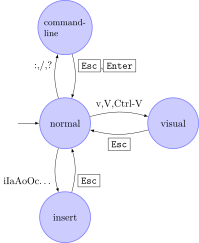

# Vim 단축키

## 공통 단축키
### 방향 이동 단축키
- `h`: 왼쪽으로 이동 
- `l`: 오른쪽으로 이동
- `k`: 위쪽으로 이동
- `j`: 아래쪽으로 이동

## 모드
- [Command Mode]()
- [Normal Mode]()
- [Insert Mode]()
- Replace Mode
    - `R`: Replace 모드로 진입
    - Replace 모드에 들어가면, 문자를 대체할수 있다.
- [Visual Mode]()

